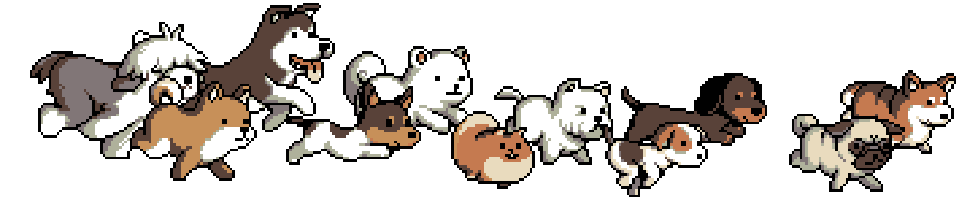
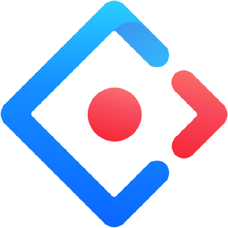
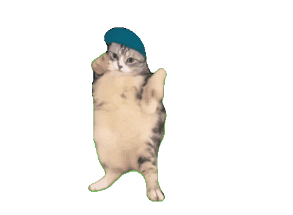

<!--
  GitHub Profile README 💕
  Author  : Dong Cong Dinh
  Contact : dongcongdinh2018@gmail.com

  ----------------------------------------------------------------------
  ----------------------------------------------------------------------

  Thank you for taking the time to review this profile README.

  You are welcome to draw inspiration or reference selected sections for
  your own profile. However, please refrain from replicating this content
  in its entirety or presenting it as your original work.

  If you choose to adapt any part of this README, ensure that all
  information is thoroughly reviewed, accurately customized, and aligned
  with your personal background and professional identity. Overlooking
  such details may unintentionally result in inconsistencies.

  Please use only the portions you clearly understand and intentionally
  incorporate into your own profile.

  ----------------------------------------------------------------------
  ----------------------------------------------------------------------

  Wishing you continued growth and success in building a professional,
  distinctive, and impactful GitHub presence.
-->

# 👋🏻 Hi there! I'm Dong Cong Dinh 


<p align="left">


<!--  -->
</p>

<div align="center">
  
</div>

| &nbsp;&nbsp;&nbsp;<small>script.js</small>&nbsp;&nbsp;&nbsp;&nbsp;&times; | &nbsp;&nbsp;&nbsp;<small>index.html</small>&nbsp;&nbsp;&nbsp;&nbsp;&times; |
| :--------------------------------------------------------------------------------------------------------------------------------------------------- | :------------------------------------------------------------------------------------------------------------------------------------------------------- |

```js
/**
 * About Me
 */
const developer = {
    name: "Dong Cong Dinh",
    role: "Frontend Developer",
    stack: ["React", "JavaScript", "TypeScript"],
    focus: ["Scalable UI", "Performance Optimization", "Clean Architecture"],
};

function introduce(dev) {
    console.info(`Hi there 😍, I'm ${dev.name}.`);
    console.info(`I'm a ${dev.role}.`);
    console.info("Nice to meet you!");
}

introduce(developer);
```

<strong>Output:</strong>

[](https://git.io/typing-svg)

<h3 align="left">❤️ Connect with me</h3>
<p align="left">
  <a href="https://fb.com/cidii2k2" target="_blank"></a>	&nbsp;
  <a href="https://www.instagram.com/cidii1111.dev" target="_blank"></a>	&nbsp;
  <a href="https://www.linkedin.com/in/dinhdc1111" target="_blank">
</a>
</p>

## 🎨 Frontend

<table>
  <tr>
    <td align="center" width="96">
        
      <br>ReactJS
    </td>
    <td align="center" width="96">
        
      <br>NextJS
    </td>
       <td align="center" width="96">
        
      <br>Angular
    </td>
    <td align="center" width="96">
        
      <br>Javascript
    </td>
      <td align="center" width="96">
      
      <br>Typescript
    </td>
    <td align="center" width="96">
      
      <br>TanStack
    </td>
    <td align="center" width="96">
        
      <br>Redux
    </td>
    <td align="center" width="96">
        
      <br>AntD
    </td>
  <td align="center" width="96">
        
      <br>Shadcn
    </td>
  </tr>
  <tr>
  <td align="center" width="96">
        
      <br>MUI
    </td>
  <td align="center" width="96">
        
      <br>Sass
    </td>
    <td align="center" width="96">
        
      <br>Less
    </td>
    <td align="center" width="96">
        
      <br>Styled
    </td>
    <td align="center" width="96">
        
      <br>Tailwind
    </td>
    <td align="center" width="96">
        
      <br>Emotion
    </td>
    <td align="center"  width="96">
        
      <br>Bootstrap
    </td>
  </tr>
  <tr>
  </tr>
</table>

## ⚙️ Other Technologies

<table>
  <tr>
  <td align="center" width="96">
      
    <br>NodeJS
  </td>
  <td align="center" width="96">
        
      <br>Express
    </td>
  <td align="center" width="96">
      
    <br>Nestjs
  </td>
  <td align="center" width="96">
      
    <br>PHP
  </td>
  <td align="center" width="96">
        
      <br>MySQL
    </td>
  <td align="center" width="96">
        
      <br>MongoDB
    </td>
  <td align="center" width="96">
        
      <br>Rest API
    </td>
  <td align="center" width="96">
      
    <br>Git
  </td>
  <td align="center"  width="96">
      
    <br>GitLab
  </td>
  </tr>
 <tr>
   <td align="center" width="96">
        
      <br>Github
    </td>
   <td align="center" width="96">
          
      <br>Prettier
    </td>
   <td align="center" width="96">
        
      <br>Postman
    </td>
    <td align="center" width="96">
          
      <br>Vite
    </td>
   <td align="center" width="96">
        
      <br>Vercel
    </td>
    <td align="center" width="96">
          
      <br>Vscode
    </td>
   <td align="center" width="96">
        
      <br>Notion
    </td>
 </tr>
</table>

## 👥 My Followers

<!-- FOLLOWERS:START -->
<table>
<tr>
<td align="center" valign="top" width="12.5%">
  <a href="https://github.com/nampq11">
    <br />
    <sub><b>nampq11</b></sub>
  </a>
</td>
<td align="center" valign="top" width="12.5%">
  <a href="https://github.com/xuanphao19">
    <br />
    <sub><b>xuanphao19</b></sub>
  </a>
</td>
<td align="center" valign="top" width="12.5%">
  <a href="https://github.com/dinhdcph14290">
    <br />
    <sub><b>dinhdcph14…</b></sub>
  </a>
</td>
<td align="center" valign="top" width="12.5%">
  <a href="https://github.com/Thanhccph">
    <br />
    <sub><b>Thanhccph</b></sub>
  </a>
</td>
<td align="center" valign="top" width="12.5%">
  <a href="https://github.com/minhduc2307">
    <br />
    <sub><b>minhduc230…</b></sub>
  </a>
</td>
<td align="center" valign="top" width="12.5%">
  <a href="https://github.com/phuonganhpt511">
    <br />
    <sub><b>phuonganhp…</b></sub>
  </a>
</td>
<td align="center" valign="top" width="12.5%">
  <a href="https://github.com/Nam2108004">
    <br />
    <sub><b>Nam2108004</b></sub>
  </a>
</td>
<td align="center" valign="top" width="12.5%">
  <a href="https://github.com/right-hand-boy">
    <br />
    <sub><b>right-hand…</b></sub>
  </a>
</td></tr>
</table>
<!-- FOLLOWERS:END -->
  
  
  
  
